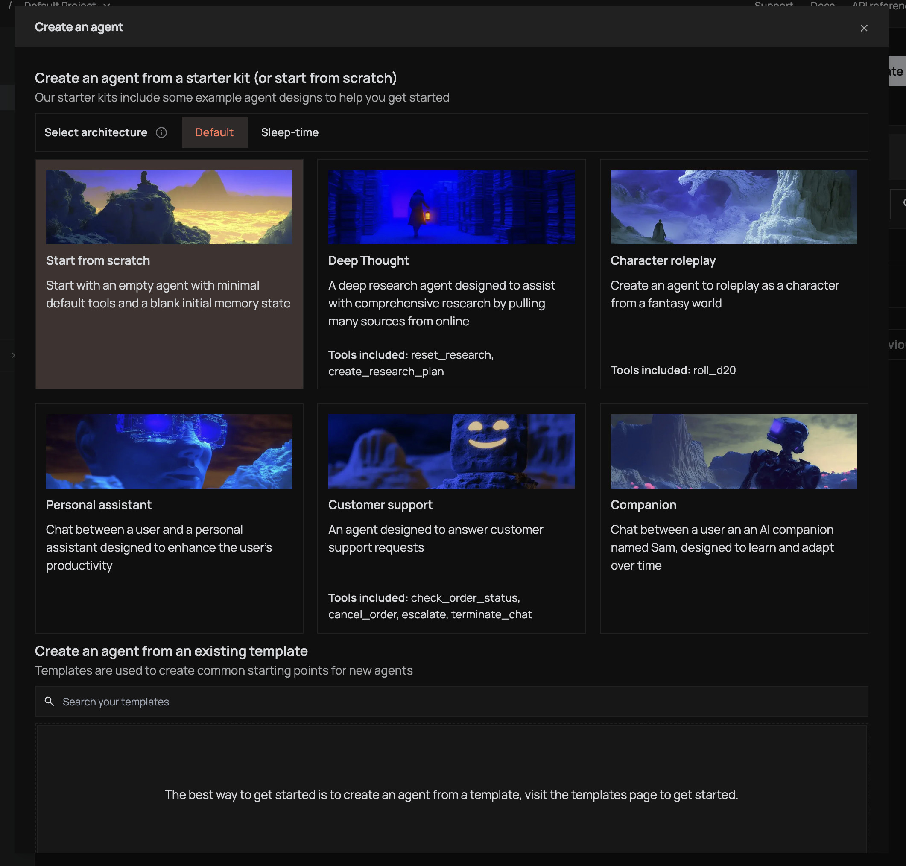
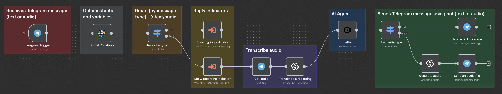

# Interact with your Letta AI agent using Telegram text messages or audio recordings

Chat with your stateful AI agent with long-term memory in your n8n workflows using a Telegram bot.


https://github.com/user-attachments/assets/9b694a36-4cc4-4039-83c2-6a9297f5d312


This document covers installation, credentials, and workflow implementation.

## Pre-requisites

We are assuming you have basic familiarity with n8n and Telegram bots.

### What you'll need

- **n8n** v1.0.0+ (Cloud or self-hosted).
- A **Telegram bot** and its **API token** (from [BotFather](https://t.me/botfather)).
- **Letta** account (Cloud or self-hosted) and an **API token**.
- A **Letta Agent ID** (e.g., `agent-90009dba-8012-46c5-a0f5-5630cc457363`).
<details>
<summary>
(Click to expand) How to create a Letta agent and get its ID
</summary>

#### To create a Letta agent:



#### And get its ID from the agent's page:


</details>

### Install the Letta community node

#### Option A — from the n8n UI (recommended)

1. In n8n, go to **Settings → Community Nodes → Install**.
2. Enter `@letta-ai/n8n-nodes-letta` and confirm.

#### Option B — npm / Docker

- In the n8n root directory:

```bash
npm install @letta-ai/n8n-nodes-letta
```

- If you run n8n with Docker, add to your `.env` **before** `N8N_CUSTOM_EXTENSIONS`, like this:

```
N8N_CUSTOM_EXTENSIONS=@letta-ai/n8n-nodes-letta
```

Then rebuild/restart n8n.

### Create Letta credentials in n8n

1. Open the **Credentials** screen → **New** → choose **Letta API**.


2. Fill in:

   - **API Token**: your Letta token (from the Letta dashboard).
   - **Base URL**: `https://api.letta.com` (or your self-hosted URL).


> Where to get the token: Letta dashboard → API settings → generate token.

## Implement the n8n workflow

You can create a workflow that listens for new Telegram messages and forwards them to your Letta agent, then sends the agent's response back to the user.

### Basic workflow

1. Create a new workflow in n8n.
2. Add a **Telegram Trigger** node:
   - Set **Resource** to `Message`.
   - Set **Operation** to `Get Updates`.
   - Enter your Telegram bot token.
   - Optionally, set **Poll Interval** (default is 3000 ms).
3. Add a **Letta - Send Message to Agent** node:


   - Connect it to the Telegram Trigger node.
   - Set **Credentials** to the Letta credentials you created.
   - Set **Agent ID** to your Letta Agent ID.
   - Set **Message** to `{{ $("Telegram Trigger").json.message.text }}`.
4. Save and activate the workflow.

### Advanced workflow with reply indicator and voice message support

See the complete workflow example [Telegram Letta Chat](./workflows/APP_TelegramLettaChat.json).



It uses the following sub-workflows:

- [TelegramTypingIndicator](./workflows/UTL_TelegramTypingIndicator.json): shows a "Typing..." message indicator on main workflow execution.


- [TelegramRecordingIndicator](./workflows/UTL_TelegramRecordingIndicator.json): shows a "Recording..." audio indicator on main workflow execution.


- [TelegramProdHookRegister](./workflows/UTL_TelegramProdHookRegister.json): registers a webhook for production use.


^ You may want to run this workflow to set up the Telegram production webhook for your bot, so you don't have to manually poll for updates (aka clicking "Execute Workflow" like a Cookie Clicker game :P).

## Resources

1. https://github.com/letta-ai/n8n-nodes-letta
2. https://core.telegram.org/api
3. https://www.npmjs.com/package/n8n-nodes-globals
4. https://docs.n8n.io/integrations/builtin/trigger-nodes/n8n-nodes-base.telegramtrigger/common-issues/
5. https://community.n8n.io/t/how-to-make-telegram-action-typing-work-while-ai-agent-processing/69149/5

## Author(s)

- [J. Ramon A. Bendiburg](https://github.com/jraleman) [@raisga](https://raisga.com/)
